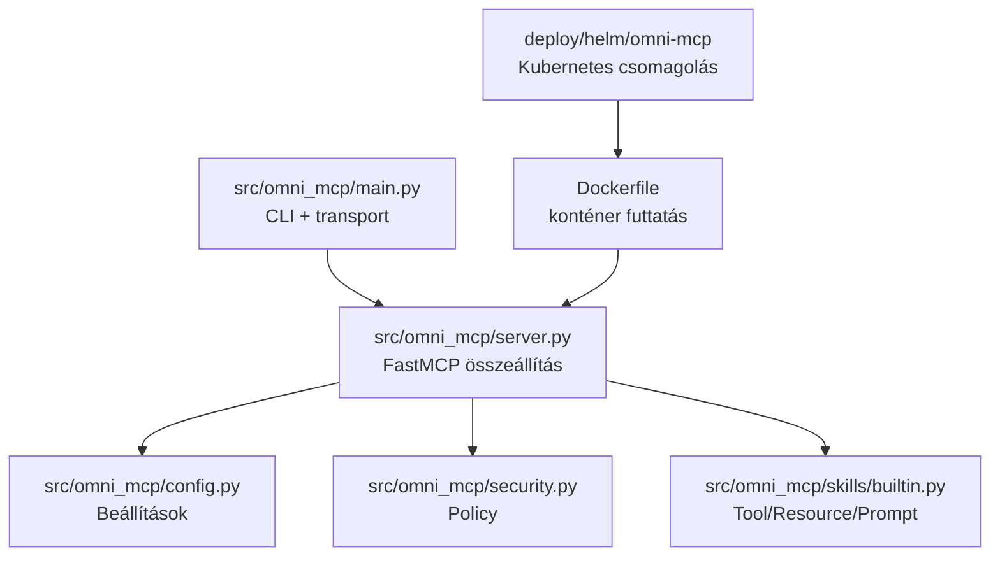
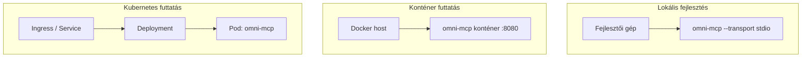

# Architektúra (HU)

## Jelenlegi állapot

Az `omni-mcp` egy moduláris, FastMCP alapú Python szerver:

- `main.py`: indítás, transport választás
- `server.py`: szerver összeállítás, logolás
- `config.py`: környezeti konfiguráció validálása
- `security.py`: központi biztonsági policy
- `skills/builtin.py`: beépített MCP képességek

## Fázis megfeleltetés

1. Fázis: helyi szerver (**megvalósítva**)
2. Fázis: külön kliens az `omni-studio` repóban (**tervezett**)
3. Fázis: Docker (**megvalósítva**)
4. Fázis: Kubernetes + Helm (**baseline megvalósítva**)

## Működési folyamat (Mermaid)

```mermaid
flowchart LR
    U[Felhasználó] --> C[omni-studio kliens\n(2. fázis)]
    S[Slack] --> C
    C -->|MCP stdio / streamable-http| M[omni-mcp szerver]

    M --> P[SecurityPolicy\n(HTTPS, allowlist, limitek)]
    M --> K[Beépített skill-ek\nTool / Resource / Prompt]
    K --> R[Válasz]
    R --> C
    C --> U
```

## Komponens felépítés (Mermaid)



## Deployment topológia (Mermaid)


