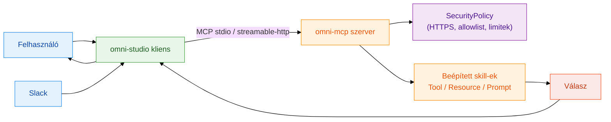
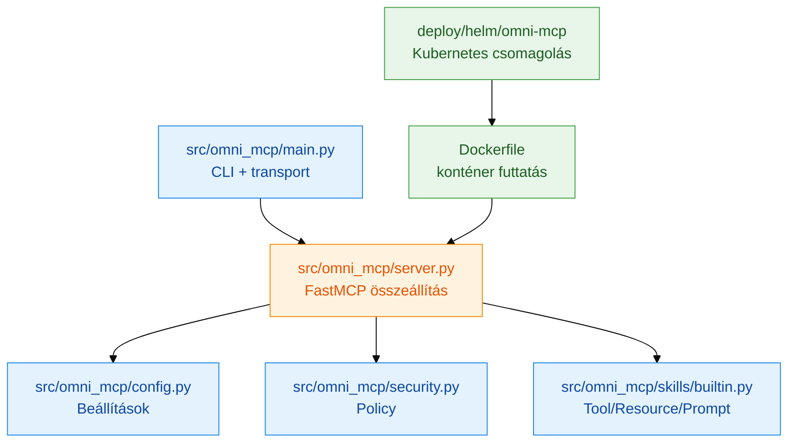

# Architektúra (HU)

## Jelenlegi állapot

Az `omni-mcp` egy moduláris, FastMCP alapú Python szerver:

- `main.py`: indítás, transport választás
- `server.py`: szerver összeállítás, logolás
- `config.py`: környezeti konfiguráció validálása
- `security.py`: központi biztonsági policy
- `skills/builtin.py`: beépített MCP képességek

## Repository felosztás

- `omni-mcp`: MCP szerver futtatás és skill-ek
- `omni-studio`: kliens alkalmazás (UI + backend orchestration)
- `helm-charts`: deployment csomagolás

## Működési folyamat (Mermaid)

## Komponens felépítés (Mermaid)

## Deployment topológia (Mermaid)

```mermaid
%%{init: {"theme": "base"}}%%
flowchart TD
    subgraph Local[Lokális fejlesztés]
        L1[Fejlesztői gép]
        L2[omni-mcp --transport stdio]
        L1 --> L2
    end

    subgraph Docker[Konténer futtatás]
        D1[Docker host]
        D2[omni-mcp konténer :8080]
        D1 --> D2
    end

    subgraph K8s[Kubernetes futtatás]
        K1[Ingress / Service]
        K2[Deployment]
        K3[Pod: omni-mcp]
        K1 --> K2 --> K3
    end

    classDef local fill:#E3F2FD,stroke:#1E88E5,color:#0D47A1,stroke-width:1px;
    classDef docker fill:#FFF8E1,stroke:#F9A825,color:#E65100,stroke-width:1px;
    classDef k8s fill:#E8F5E9,stroke:#43A047,color:#1B5E20,stroke-width:1px;

    class L1,L2 local;
    class D1,D2 docker;
    class K1,K2,K3 k8s;
```

