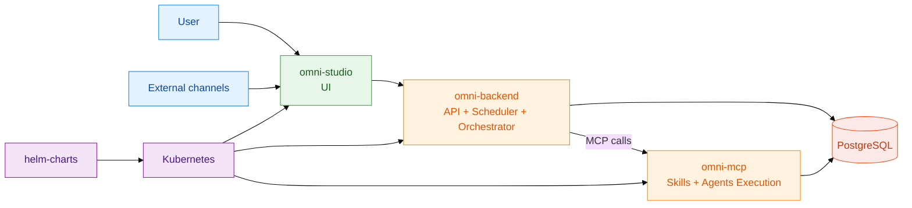
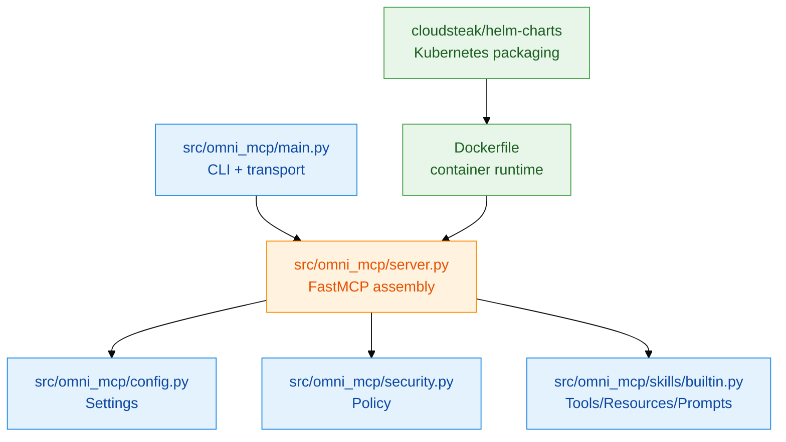

# Architecture

## Current state

`omni-mcp` is a modular Python MCP server using FastMCP:

- `src/omni_mcp/main.py`: CLI entrypoint and transport selection
- `src/omni_mcp/server.py`: server assembly and logging
- `src/omni_mcp/config.py`: validated environment config
- `src/omni_mcp/security.py`: shared security policy helpers
- `src/omni_mcp/skills/builtin.py`: built-in MCP tools/resources/prompts

## Repository landscape

- `omni-mcp`: MCP server runtime and skills
- `omni-studio`: client application (UI)
- `omni-backend`: API + scheduler + orchestration
- `helm-charts`: deployment packaging

## Runtime flow (Mermaid)

## Component structure (Mermaid)

## Deployment topology (Mermaid)

```mermaid
%%{init: {"theme": "base"}}%%
flowchart TD
    subgraph Local[Local development]
        L1[Developer machine]
        L2[omni-mcp --transport stdio]
        L1 --> L2
    end

    subgraph Docker[Container runtime]
        D1[Docker host]
        D2[omni-mcp container :8080]
        D1 --> D2
    end

    subgraph K8s[Kubernetes runtime]
        K1[Ingress / Service]
        K2[Deployment]
        K3[Pod: omni-mcp]
        K1 --> K2 --> K3
    end

    classDef local fill:#E3F2FD,stroke:#1E88E5,color:#0D47A1,stroke-width:1px;
    classDef docker fill:#FFF8E1,stroke:#F9A825,color:#E65100,stroke-width:1px;
    classDef k8s fill:#E8F5E9,stroke:#43A047,color:#1B5E20,stroke-width:1px;

    class L1,L2 local;
    class D1,D2 docker;
    class K1,K2,K3 k8s;
```

## Client communication model

- Primary client: `omni-studio`
- Control plane: `omni-backend` (auth-aware API, scheduling, orchestration)
- Execution plane: `omni-mcp` over MCP transport
