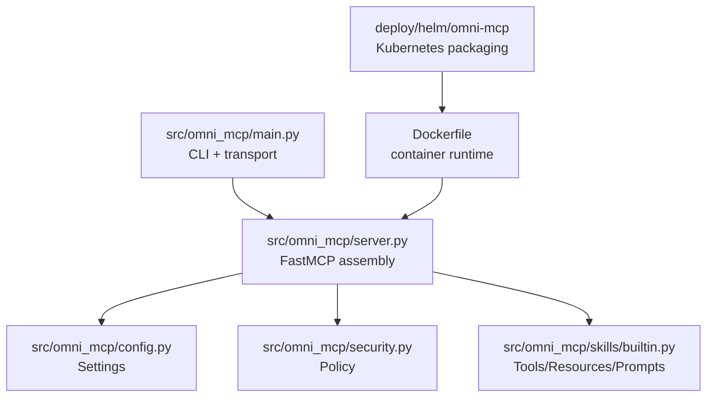
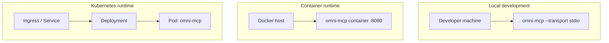

# Architecture

## Current state

`omni-mcp` is a modular Python MCP server using FastMCP:

- `src/omni_mcp/main.py`: CLI entrypoint and transport selection
- `src/omni_mcp/server.py`: server assembly and logging
- `src/omni_mcp/config.py`: validated environment config
- `src/omni_mcp/security.py`: shared security policy helpers
- `src/omni_mcp/skills/builtin.py`: built-in MCP tools/resources/prompts

## Phase mapping

1. Phase 1 (implemented): local MCP server
2. Phase 2 (planned in another repo): dedicated client in `omni-studio`, with optional Slack ingress
3. Phase 3 (implemented): Docker image and runtime defaults
4. Phase 4 (implemented baseline): Kubernetes-compatible Helm chart

## Runtime flow (Mermaid)

```mermaid
flowchart LR
    U[User] --> C[omni-studio client\n(Phase 2)]
    S[Slack] --> C
    C -->|MCP stdio / streamable-http| M[omni-mcp server]

    M --> P[SecurityPolicy\n(HTTPS, allowlist, limits)]
    M --> K[Built-in Skills\nTools / Resources / Prompts]
    K --> R[Result]
    R --> C
    C --> U
```

## Component structure (Mermaid)



## Deployment topology (Mermaid)



## Client communication model (planned)

- Primary client: dedicated app in `omni-studio`
- Protocol: MCP transport (`stdio` locally, `streamable-http` for networked deployments)
- Slack requests: handled by client, then forwarded to `omni-mcp` over MCP

This keeps Slack credentials and channel-specific logic out of the server runtime.
